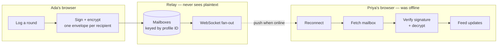

# Always-on rounds feed — scope

**Status:** proposal, nothing built yet
**Author:** drafted alongside the v0.1 client
**Decision needed before work starts:** see [Decisions I need from you](#decisions-i-need-from-you)

---

## The ask, stated precisely

Today a round reaches a peer only while a direct connection is open, or when someone hands
over a `PFR1.…` code. You want the other thing: **Ada buys Priya a coffee, and it appears
on Priya's feed even though Priya's app is closed, on a different network, three time zones
away.**

That is a delivery guarantee, and delivery guarantees need something that stays awake. This
document is about what that something should be, what it costs, and — the part worth most
of your attention — what it changes about the product.

---

## Recommendation in one paragraph

Build a **thin encrypted relay**: a small server that holds sealed envelopes addressed to
profile IDs and pushes them over a WebSocket, never able to read a single drink order.
Give every profile a **cryptographic identity** (a keypair generated on-device) so nobody
can post rounds pretending to be you. Make the relay **entirely optional** — the app keeps
working exactly as it does now with it switched off. Estimated **3–4 weeks** to a version
you would let real people use, of which identity is the first week and the hardest part.

---

## What this costs the product

Worth being blunt, because these are the properties the app was built around and three of
them genuinely go away.

| Property today | After an always-on feed |
| --- | --- |
| No server | A server exists, and can go down or be shut off |
| Nothing to run or pay for | Hosting bill, however small, forever |
| Works offline indefinitely | Feed needs connectivity; profiles still work offline |
| No identity to steal or lose | A private key you can lose — losing it loses your identity |
| Zero metadata anywhere | The relay sees *who sends to whom, and when* |
| Nothing to moderate | Someone can now push unwanted content at you |

The mitigation for most of this is the same: **make it opt-in per install.** A member who
never turns it on has today's app, byte for byte. That is not a hedge — it is the honest
architecture, because the two modes want genuinely different guarantees.

---

## Architecture

### The shape



The relay is deliberately dumb. It authenticates that a sender is who they claim, stores
opaque bytes against a recipient ID, pushes them, and forgets them once acknowledged or
after a TTL. It cannot read a round, cannot construct one, and cannot alter one without the
recipient noticing.

### Options considered

| Option | Verdict |
| --- | --- |
| **A. Thin encrypted relay** (recommended) | Keeps the trust model close to today's. Small, cheap, boring to operate. |
| **B. Conventional backend with accounts** | Email/password, server-side feed, full query power. Most capable, most work, and abandons the app's premise. Right choice only if you later want discovery, a web profile, or analytics. |
| **C. Managed realtime (Supabase / Firebase)** | Fastest to a demo — days, not weeks. Hands identity and plaintext to a vendor, and you still have to design auth. Reasonable for a pilot; awkward to walk back. |
| **D. Gossip through mutual friends** | No server at all: rounds hop via whoever is online. Delivery becomes probabilistic, latency unbounded, and it leaks your activity to intermediaries. Fails the "always on" requirement. Rejected. |

If you want something demonstrable in **three days rather than three weeks**, take C as a
throwaway prototype and keep A as the real target. Do not let C become the real thing by
accident — its identity model is the part you cannot retrofit cheaply.

---

## Identity: the actual hard problem

Right now `Profile.id` is a random 12-character string the client makes up. That is fine
today, because a profile only ever arrives from someone who physically handed it to you. It
falls apart the moment a server accepts messages: **anything self-asserted can be forged.**
Without fixing this, I can claim to be you and post that you bought everyone a round of
tequila.

### Proposal

- On first run, generate an **Ed25519 keypair** with WebCrypto. Never leaves the device.
- `profileId = base64url(SHA-256(publicKey)).slice(0, 16)` — the ID *is* the key's
  fingerprint, so an ID cannot be claimed by anyone who lacks the key.
- Share codes carry the public key. Peers verify every signed object against it.
- Every round is signed by its buyer. **The relay verifies, and so does every client** — so
  a compromised relay still cannot forge activity.
- Still no email, no password, no sign-up screen. Identity is a key, created silently.

### The cost, which is real

Lose the key and you lose the identity. There is no reset link because there is no account.
Mitigations, none of them free:

- Key is included in the existing backup export (already built) — becomes strongly
  recommended rather than optional.
- Optional passphrase-wrapped key export for moving to a new device.
- Multi-device would need key sync — **out of scope for v1**, and worth saying out loud
  that v1 means one device per identity.

### Migrating existing profiles

Profiles created before this change have no key. Plan:

1. On upgrade, generate a keypair and attach it, **keeping the existing ID** so peers do not
   have to re-import anyone.
2. Objects signed by a key whose fingerprint does not match the ID render as
   **"unverified"** — visible, not hidden.
3. Legacy IDs can never be promoted to verified. A member who wants a verified identity
   takes a new ID and re-shares. The UI should explain this in one sentence, once.

This is honest and incremental. The alternative — forcing everyone onto new IDs — breaks
every share link already in the wild.

---

## What the relay can see

E2EE protects content, not the fact of communication. Stated plainly, because "encrypted"
is often heard as "invisible":

**Hidden:** every drink, every name inside a round, notes, occasions, dietary flags,
profile photos.

**Visible:** that profile `abc…` sent an envelope to profile `xyz…` at a given time, and
roughly how big it was. Over months that is a social graph and a daily rhythm.

Reducing that further means sealed-sender or mixnet-style delivery, which is a large project
on its own. **Out of scope**, but the privacy copy in the app must not claim more than the
design delivers.

---

## Consent: a feed makes claims about other people

This is the design point I would most want you to weigh in on, and it is easy to miss.

A round is not a post about yourself. It is a **statement about someone else** — that they
were with you, at a shop, at a time, drinking a thing. Reconstructing "who was in the room"
from a feed is trivial. A drink order can also imply pregnancy, sobriety, or a medical
condition.

So delivery cannot be unconditional. Minimum for v1:

- **Mutual-import required.** A round only reaches you from someone whose profile you have
  imported. This also kills spam without any content moderation.
- **Per-person control**: allow anyone I've imported / only people I mark / nobody.
- **Right of reply on your own record**: remove a round that names you from your own feed,
  and tell the sender you did.
- **Nothing retroactive.** Turning the relay on must never upload the rounds already sitting
  in local storage.

Deliberately not in v1: public feeds, discovery, follower graphs, anything resembling a
social network. That is a different product with a different risk profile.

---

## Data model and API

Small enough to state in full.

```ts
// Signed and encrypted client-side. The relay stores `envelope` as opaque bytes.
interface Envelope {
  id: string;              // ULID — sortable, unique
  to: string;              // recipient profile ID
  from: string;            // sender profile ID (fingerprint of their public key)
  at: number;              // server receive time, for ordering only
  sig: string;             // Ed25519 over (id, to, from, envelope)
  envelope: string;        // X25519 → AES-GCM ciphertext of the Round
}
```

| Endpoint | Purpose |
| --- | --- |
| `POST /v1/envelopes` | Send. Rejects unsigned, malformed, or over-rate. |
| `GET /v1/mailbox?since=<ulid>` | Catch up after being offline. |
| `WS /v1/live` | Push while connected. Challenge-response auth on connect. |
| `POST /v1/ack` | Acknowledge; relay may drop acked envelopes. |
| `POST /v1/keys` | Publish public key for a profile ID (write-once). |
| `DELETE /v1/me` | Erase everything held for this identity. |

Retention: envelopes deleted on ack, or after **30 days** unread. The relay is a mailbox,
not an archive — the archive is each member's own device, as it is today.

**Client changes** are smaller than they look, because the round model, merge-by-ID, and
feed UI already exist and were built to accept rounds from outside. The new code is
identity, crypto, a sync worker, and connection state in the UI.

---

## Phases and estimates

Estimates assume one developer and include tests. They are estimates.

| Phase | Work | Est. | Ships value alone? |
| --- | --- | --- | --- |
| **0. Identity** | Keypairs, signing, verification, verified badge, migration, key in backup | 4–6 days | **Yes** — stops impersonation in today's P2P flow, no server needed |
| **1. Relay MVP** | Server, mailbox, WebSocket, auth, client sync, connection UI | 5–8 days | Yes — the actual always-on feed |
| **2. Encryption + consent** | X25519 + AES-GCM, per-person permissions, block, right of reply | 4–5 days | Must ship with or before any real use |
| **3. Notifications** | Service worker, Web Push, VAPID, badges, quiet hours | 3–4 days | Optional but it is what people expect |
| **4. Operations** | Rate limits, abuse handling, retention job, deletion, privacy policy, monitoring | 3–5 days | Not optional with real users |

**Total: 19–28 working days.** Phase 0 is worth doing whether or not you ever build the
relay, which is why I would start there regardless.

I would ship 0 → 2 as the first release. Phase 3 is the one most likely to get cut and least
likely to be missed; phase 4 is the one most likely to get cut and most likely to hurt.

---

## Running costs

| Item | Estimate |
| --- | --- |
| Cloudflare Workers + Durable Objects | ~$5/month at small scale |
| Alternative: single small VM (Fly.io / Hetzner) | $5–10/month |
| Domain | ~$15/year |
| Web Push | Free (VAPID) |

Load is trivial: 1,000 active members at five rounds a day averaging three recipients is
~15,000 envelopes daily, a few KB each. This stays inside the cheapest tier for a long
time. **Cost is not the constraint — operating a service that holds other people's social
graph is.** Someone has to own uptime, abuse reports, and deletion requests.

---

## Risks

| Risk | Mitigation |
| --- | --- |
| Key loss orphans an identity | Key in backup export, prompt to back up on creation, passphrase export |
| Metadata leak at the relay | Say so plainly; padding and batching if it matters more later |
| Unwanted rounds naming you | Mutual-import requirement, per-person permissions, right of reply |
| Relay outage looks like data loss | Local-first stays authoritative; queue and retry; show connection state honestly |
| Scope creep into a social network | Written exclusions: no discovery, no public feeds, no follower graph |
| Legal surface (GDPR, minors, alcohol content) | Deletion endpoint, retention policy, privacy policy before launch, not after |

---

## What I would cut from v1

Multi-device key sync · read receipts · reactions and comments · group or venue feeds ·
public profiles · web view of a profile · media attachments in rounds · editing a sent
round (removal only) · anything discovery-shaped.

---

## Decisions I need from you

1. **Optional relay, or always-on for everyone?** I recommend optional — it preserves
   today's guarantees for people who chose the app because of them.
2. **Encrypted from day one, or plaintext first?** I recommend encrypted. Retrofitting
   crypto means a second migration and a window where the relay holds readable data.
3. **Who runs it?** Someone owns uptime, abuse, and deletion requests. This is the question
   most likely to decide whether this should exist.
4. **Three-day managed prototype first,** or straight to the real thing?
5. **Is one-device-per-identity acceptable for v1?** Multi-device roughly doubles phase 0.

Answer 1–3 and I can start on phase 0 immediately, since identity is worth building either
way.
